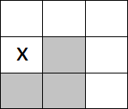
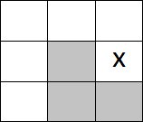
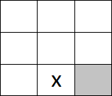
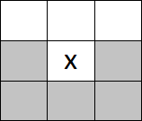
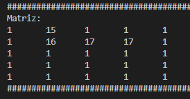
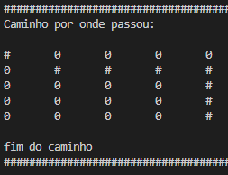
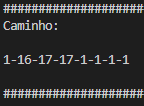
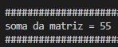
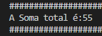

# Matriz_Caminho_Guloso

>Status: Finalizado
## Algoritmo Guloso
Algoritmo que tenta resolver o problema fazendo a escolha localmente ótima em cada fase com a esperança de encontrar um ótimo global.

## Exercício proposto

Programa que soma os maiores valores do caminho de uma matriz quadrada caminhando por K matrizes quadradas de tamanho NxN de inteiros, iniciando da posição 0,0, e indo para o próximo maior número que esteja a direita, a esquerda, abaixo ou em alguma das duas diagonais para baixo da posição testada, desde que essa posição ainda não tenha sido acessada. Somente na última linha tem um comportamento diferente, pois sempre andará para a direita até o fim da matriz.

## Inicialização:
O programa começa com uma matriz sendo gerada pelo código: 
***https://github.com/mpiress/GenerateDataToMatrix*** que sempre irá criar um arquivo de nome ***input.data***, podendo alterar o tamanho do **N** e de **K** explicados na seção **Exercício proposto**.

## Lógica:
Começando pelo constructor da classe **Matriz** que recebe o nome do arquivo e é responsável por chamar as futuras funções do código.
Ele começa abrindo o arquivo, e em seguida recebe primeiro o tamanho das matrizes que estão na primeira linha do arquivo. Depois é declarada e chamada a função ***'lerMatriz()'*** onde será lida a matriz e chamada a função ***'caminharMatriz()'*** enquanto o arquivo estiver aberto.

A função ***caminharMatriz()*** irá testar os possíveis casos:
 
****x representa a posição atual e os quadrados coloridos as possiveis posições que serão testadas***

### **Caso 1** 
+ ##### Primeira coluna:

  

Nesse caso é impossível retornar para qualquer posição à esquerda, já que estamos na primeira coluna.

### **Caso 2** 
+ ##### Última coluna:

  

Nesse caso é impossível avançar para qualquer posição à direita, já que estamos na última coluna.

### **Caso 3** 
+ ##### Última linha:

  

Sempre que x estiver na última linha a próxima posição será à direita até alcançar a última posição da matriz.

### **Caso 4** 
+ ##### Todas as posições possíveis:

  

Nesse caso deve caminhar para a direita, para baixo, diagonal inferior direita, diagonal inferior esquerda, ou esquerda, nessa mesma ordem escrita.

***Lembrando que caso tenham dois ou mais inteiros de mesmo valor a prioridade é a direita!**

## Finalização:
+ ##### Em seguida será impresso na tela a matriz pela função ***imprimirMatriz()***:

  

+ ##### o caminho percorrido: 

   
 *Onde '#' representa as posições que o código passou.

+ ##### o caminho por onde passou:

  

+ ##### e a soma do caminho da matriz:

  

+ ##### A cada matriz passada ela retornará o valor da soma para a variável ***somaTotal*** que ao final de tudo imprimirá o valor de todas as somas:

  

